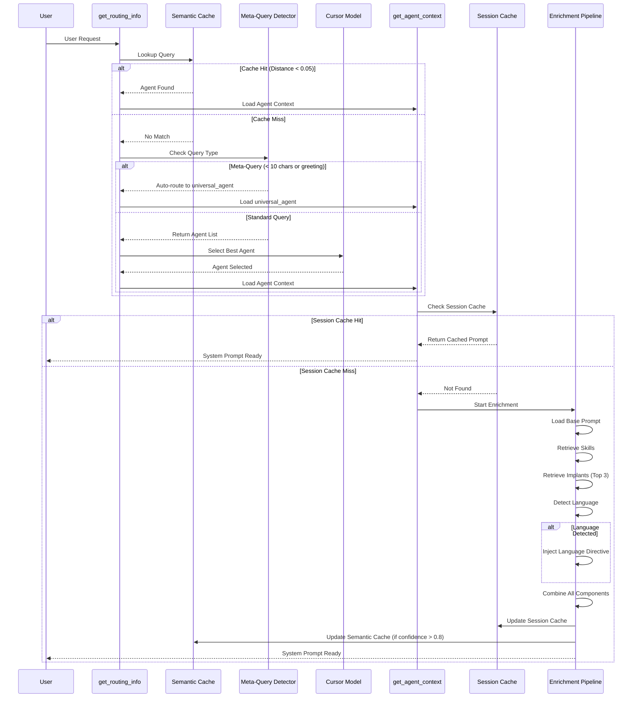

# Request Routing Flow

This diagram illustrates the decision-making process for routing user requests to the appropriate agent.

## Routing Flow Sequence

## Key Components

1.  **Semantic Cache**: Uses ChromaDB to store and retrieve previous routing decisions. A match occurs if the cosine distance is less than 0.05 (Similarity > 0.95).
2.  **Meta-Query Detection**: Automatically routes short queries (< 10 chars) or common greetings to `universal_agent` to reduce latency and model overhead.
3.  **Cursor Fallback**: If no cache hit and not a meta-query, the system returns the list of agents, allowing the Cursor model to make a semantic decision based on the query.
4.  **Enrichment Pipeline**:
    *   **Skills**: Retrieves relevant reusable skills (e.g., `git_operations`).
    *   **Implants**: Injects up to 3 cognitive implants (mental models) based on the query.
    *   **Language**: Detects the user's language and injects a critical instruction to respond in that language.
5.  **Session Cache**: Stores enriched prompts keyed by agent name and query hash to speed up repeated requests within the same session.
