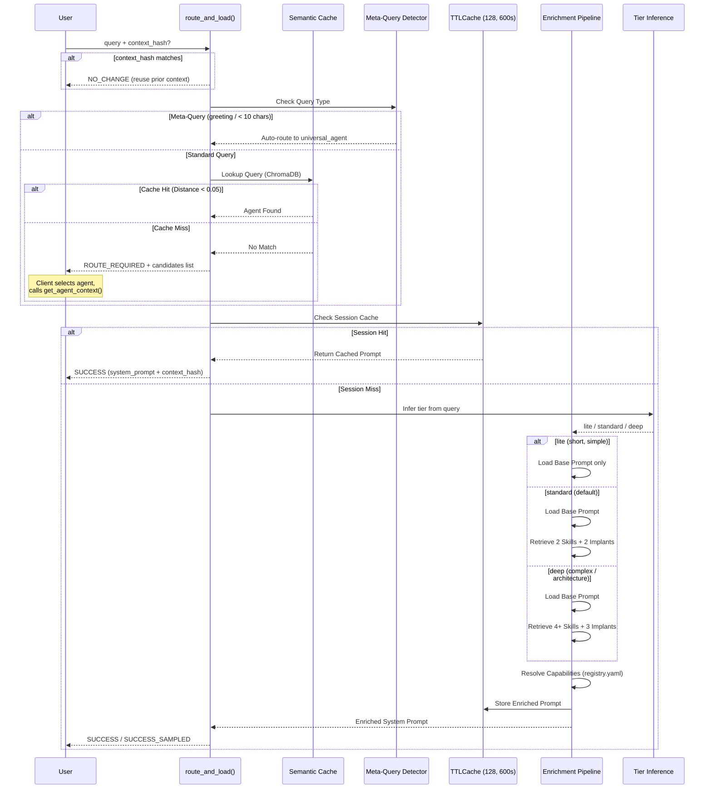

# Request Routing Flow

This diagram illustrates the decision-making process for routing user requests to the appropriate agent via `route_and_load()`.

## Routing Flow Sequence

```mermaid
sequenceDiagram
    participant User
    participant RAL as route_and_load()
    participant Cache as Semantic Cache
    participant Meta as Meta-Query Detector
    participant Session as TTLCache (128, 600s)
    participant Enrich as Enrichment Pipeline
    participant Tier as Tier Inference

    User->>RAL: query + context_hash?

    alt context_hash matches
        RAL-->>User: NO_CHANGE (reuse prior context)
    end

    RAL->>Meta: Check Query Type
    alt Meta-Query (greeting / < 10 chars)
        Meta-->>RAL: Auto-route to universal_agent
    else Standard Query
        RAL->>Cache: Lookup Query (ChromaDB)
        alt Cache Hit (Distance < 0.05)
            Cache-->>RAL: Agent Found
        else Cache Miss
            Cache-->>RAL: No Match
            RAL-->>User: ROUTE_REQUIRED + candidates list
            Note over User: Client selects agent,<br/>calls get_agent_context()
        end
    end

    RAL->>Session: Check Session Cache
    alt Session Hit
        Session-->>RAL: Return Cached Prompt
        RAL-->>User: SUCCESS (system_prompt + context_hash)
    else Session Miss
        RAL->>Tier: Infer tier from query
        Tier-->>Enrich: lite / standard / deep

        alt lite (short, simple)
            Enrich->>Enrich: Load Base Prompt only
        else standard (default)
            Enrich->>Enrich: Load Base Prompt
            Enrich->>Enrich: Retrieve 2 Skills + 2 Implants
        else deep (complex / architecture)
            Enrich->>Enrich: Load Base Prompt
            Enrich->>Enrich: Retrieve 4+ Skills + 3 Implants
        end

        Enrich->>Enrich: Resolve Capabilities (registry.yaml)
        Enrich->>Session: Store Enriched Prompt
        Enrich-->>RAL: Enriched System Prompt
        RAL-->>User: SUCCESS / SUCCESS_SAMPLED
    end
```

## Key Components

1. **Semantic Cache**: Uses ChromaDB to store and retrieve previous routing decisions. A match occurs if the cosine distance is less than 0.05 (Similarity > 0.95).
2. **Meta-Query Detection**: Regex-based detection of greetings and short queries (English + Russian) for auto-routing to `universal_agent`.
3. **ROUTE_REQUIRED**: On cache miss, the system returns a list of agent candidates with descriptions, allowing the client LLM to select the best match via `get_agent_context()`.
4. **Tier Inference**: Determines enrichment depth based on query complexity:
    * **lite**: Short/simple queries — no skills or implants loaded.
    * **standard**: Default — 2 skills + 2 implants selected via RAG.
    * **deep**: Complex/architecture queries — 4+ skills + 3 implants with full capability resolution.
5. **Enrichment Pipeline**:
    * **Skills**: Domain-specific knowledge modules retrieved via ChromaDB.
    * **Implants**: Cognitive reasoning strategies (e.g., chain-of-code, reflexion).
    * **Capabilities**: High-level compositions from `registry.yaml` mapping to skill stacks + directives.
6. **Session Cache**: TTLCache (max 128 entries, 600s TTL) storing enriched prompts keyed by agent name. Supports `context_hash` for multi-turn delta optimization.
