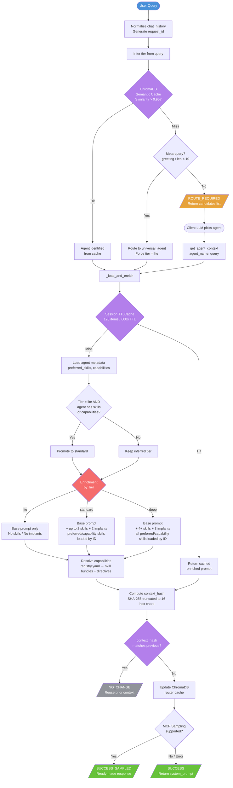
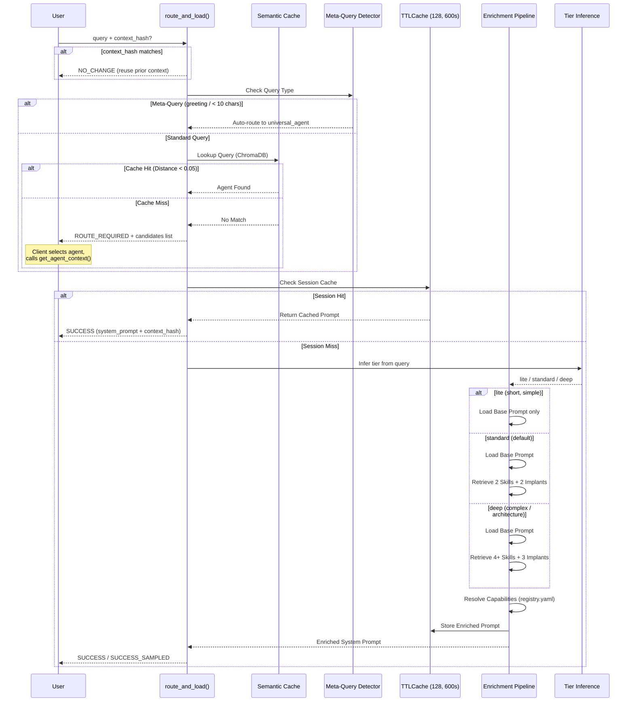

# Request Routing Flow

This document describes the routing and enrichment pipeline for the Agents-Core MCP server.

## Architecture Overview

```mermaid
graph TD
    Start([User Query]) --> Normalize[Normalize chat_history<br/>Generate request_id]
    Normalize --> InferTier[Infer tier from query]
    InferTier --> CacheLookup{ChromaDB<br/>Semantic Cache<br/>Similarity > 0.95?}

    CacheLookup -->|Hit| AgentFound[Agent identified<br/>from cache]
    CacheLookup -->|Miss| MetaCheck{Meta-query?<br/>greeting / len < 10}

    MetaCheck -->|Yes| Universal[Route to universal_agent<br/>Force tier = lite]
    MetaCheck -->|No| RouteRequired[/"ROUTE_REQUIRED<br/>Return candidates list"/]

    RouteRequired --> ClientPicks([Client LLM picks agent])
    ClientPicks --> GetAgent[get_agent_context<br/>agent_name, query]

    AgentFound --> LoadEnrich
    Universal --> LoadEnrich
    GetAgent --> LoadEnrich

    LoadEnrich[_load_and_enrich] --> SessionCache{Session TTLCache<br/>128 items / 600s TTL}

    SessionCache -->|Hit| CachedPrompt[Return cached<br/>enriched prompt]
    SessionCache -->|Miss| LoadMeta[Load agent metadata<br/>preferred_skills, capabilities]

    LoadMeta --> TierPromo{Tier = lite AND<br/>agent has skills<br/>or capabilities?}
    TierPromo -->|Yes| Promote[Promote to standard]
    TierPromo -->|No| KeepTier[Keep inferred tier]

    Promote --> Enrich
    KeepTier --> Enrich

    Enrich{Enrichment<br/>by Tier}

    Enrich -->|lite| Lite[Base prompt only<br/>No skills / No implants]
    Enrich -->|standard| Standard[Base prompt<br/>+ up to 2 skills + 2 implants<br/>preferred/capability skills loaded by ID]
    Enrich -->|deep| Deep[Base prompt<br/>+ 4+ skills + 3 implants<br/>all preferred/capability skills loaded by ID]

    Lite --> ResolveCaps
    Standard --> ResolveCaps
    Deep --> ResolveCaps

    ResolveCaps[Resolve capabilities<br/>registry.yaml → skill bundles + directives]

    ResolveCaps --> ComputeHash[Compute context_hash<br/>SHA-256 truncated to 16 hex chars]
    CachedPrompt --> ComputeHash

    ComputeHash --> HashCompare{context_hash<br/>matches previous?}

    HashCompare -->|Yes| NoChange[/"NO_CHANGE<br/>Reuse prior context"/]
    HashCompare -->|No| UpdateCache[Update ChromaDB<br/>router cache]

    UpdateCache --> Sampling{MCP Sampling<br/>supported?}

    Sampling -->|Yes| Sampled[/"SUCCESS_SAMPLED<br/>Ready-made response"/]
    Sampling -->|No / Error| Success[/"SUCCESS<br/>Return system_prompt"/]

    style Start fill:#4A90D9,color:#fff
    style RouteRequired fill:#E6A23C,color:#fff
    style NoChange fill:#909399,color:#fff
    style Sampled fill:#67C23A,color:#fff
    style Success fill:#67C23A,color:#fff
    style Enrich fill:#F56C6C,color:#fff
    style CacheLookup fill:#B37FEB,color:#fff
    style SessionCache fill:#B37FEB,color:#fff
    style HashCompare fill:#B37FEB,color:#fff
```

## Tier Inference Rules

| Signal | Tier | Enrichment |
|--------|------|------------|
| Query < 50 chars, no complex keywords | **lite** | Base prompt only |
| Default / moderate complexity | **standard** | Up to 2 skills + 2 implants (preferred by ID when declared, RAG otherwise) |
| Query > 300 chars OR complex keywords (`debug`, `investigate`, `compare`, `design`, `review`, `audit`, `deep dive`, plus Russian equivalents) | **deep** | 4+ skills + 3 implants (preferred by ID + RAG fallback) |

> **Tier Promotion**: If the inferred tier is `lite` but the target agent declares `preferred_skills` or `capabilities`, the tier is automatically promoted to `standard` to ensure skills are loaded.

## Routing Sequence (Detailed)

```mermaid
sequenceDiagram
    participant User
    participant RAL as route_and_load()
    participant Cache as Semantic Cache
    participant Meta as Meta-Query Detector
    participant Session as TTLCache (128, 600s)
    participant Enrich as Enrichment Pipeline
    participant Tier as Tier Inference

    User->>RAL: query + context_hash?

    alt context_hash matches
        RAL-->>User: NO_CHANGE (reuse prior context)
    end

    RAL->>Meta: Check Query Type
    alt Meta-Query (greeting / < 10 chars)
        Meta-->>RAL: Auto-route to universal_agent
    else Standard Query
        RAL->>Cache: Lookup Query (ChromaDB)
        alt Cache Hit (Distance < 0.05)
            Cache-->>RAL: Agent Found
        else Cache Miss
            Cache-->>RAL: No Match
            RAL-->>User: ROUTE_REQUIRED + candidates list
            Note over User: Client selects agent,<br/>calls get_agent_context()
        end
    end

    RAL->>Session: Check Session Cache
    alt Session Hit
        Session-->>RAL: Return Cached Prompt
        RAL-->>User: SUCCESS (system_prompt + context_hash)
    else Session Miss
        RAL->>Tier: Infer tier from query
        Tier-->>Enrich: lite / standard / deep

        alt lite (short, simple)
            Enrich->>Enrich: Load Base Prompt only
        else standard (default)
            Enrich->>Enrich: Load Base Prompt
            Enrich->>Enrich: Retrieve 2 Skills + 2 Implants
        else deep (complex / architecture)
            Enrich->>Enrich: Load Base Prompt
            Enrich->>Enrich: Retrieve 4+ Skills + 3 Implants
        end

        Enrich->>Enrich: Resolve Capabilities (registry.yaml)
        Enrich->>Session: Store Enriched Prompt
        Enrich-->>RAL: Enriched System Prompt
        RAL-->>User: SUCCESS / SUCCESS_SAMPLED
    end
```

## Key Components

1. **Semantic Cache**: Uses ChromaDB with `BAAI/bge-m3` embeddings to store and retrieve previous routing decisions. A match occurs if the cosine similarity exceeds 0.95 (distance < 0.05).
2. **Meta-Query Detection**: Regex-based detection of greetings and short queries (English + Russian) for auto-routing to `universal_agent`.
3. **ROUTE_REQUIRED**: On cache miss, the system returns a list of agent candidates with metadata (`display_name`, `role`, `trigger_command`), allowing the client LLM to select the best match via `get_agent_context()`.
4. **Tier Inference**: Determines enrichment depth based on query complexity signals (length, keywords). Automatic promotion from `lite` to `standard` when agents declare skills or capabilities.
5. **Enrichment Pipeline**:
    * **Skills**: Domain-specific knowledge modules. When an agent declares `preferred_skills` or `capabilities`, those skills are loaded by exact ID (no vector search, no count limit). Otherwise, skills are retrieved via ChromaDB semantic search (threshold: 0.55 distance).
    * **Implants**: Cognitive reasoning strategies retrieved via semantic search (threshold: 0.73 distance). Agents can request more at runtime via `load_implants()`.
    * **Capabilities**: High-level compositions from `registry.yaml` mapping to skill bundles + behavioral directives.
6. **Session Cache**: TTLCache (max 128 entries, 600s TTL) storing enriched prompts keyed by `{agent_name}:{query_hash}:{tier}`. Supports `context_hash` for multi-turn delta optimization.
7. **MCP Sampling**: When the client supports MCP sampling, the server generates a response directly (`SUCCESS_SAMPLED`). Otherwise, it returns the enriched system prompt for the client to use (`SUCCESS`).
